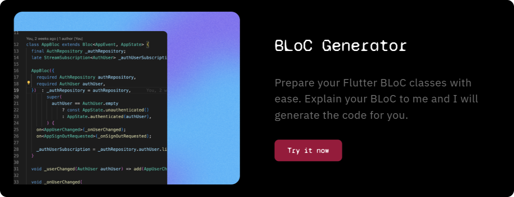
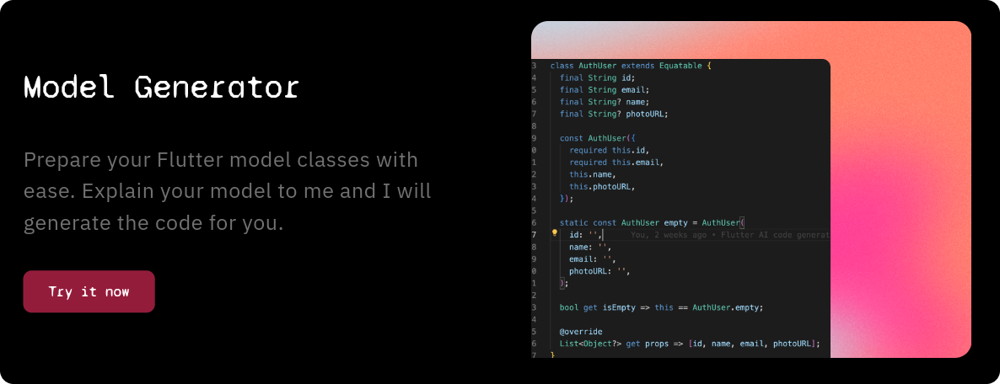

# ai_generated_flutter_code

  

junior is an AI pair-programmer for Flutter developers. 

**Learn more at [junior.atomsbox.com](https://junior.atomsbox.com)!**

---

junior offers multiple code generators powered by AI models (GPT 3.5 turbo and GPT4) and customized to deliver the best results for Flutter developers. 

