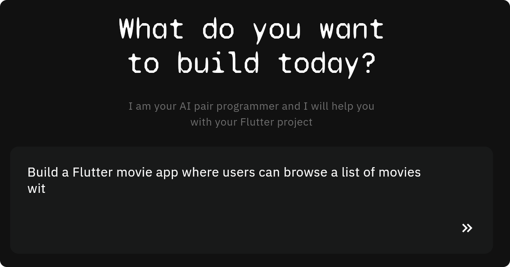

# Generate Flutter code with junior

  

junior is an AI pair-programmer for Flutter developers. 

**Learn more at [junior.atomsbox.com](https://junior.atomsbox.com)!**

---

junior offers multiple code generators powered by AI models (GPT 3.5 turbo and GPT4) and customized to deliver the best results for Flutter developers. Currently, there are:
- The BLoC Generator
- The Model Generator
- The Flutter AI Full-Codebase

Coming soon:
- Unit test generator
- Widget test generator

## BLoC Generator
The BLoC Generator helps you to prepare your Flutter BLoC classes with ease. Explain to junior what's the task and the scope of the BLoC and it will create it for you. 

A few examples of the prompt and the output are in the [bloc_generator folder](bloc_generator). The example code is not edited, it is shown as it is returned by junior, your Flutter AI pair programmer.

---

## Model Generator
The Model Generator helps you to prepare model class for your Flutter apps. Explain the context of your data model to junior, and it will prepare the model for you. It can add JSON serialization, value-based equality, copyWith and real-life sample data. too. 

A few examples of the prompt and the output are in the [model_generator folder](model_generator). The example code is not edited, it is shown as it is returned by junior, your Flutter AI pair programmer.

---

## Flutter AI Full-Codebase
The Flutter AI Codebase (inspired to BabyAGI and smol-ai/developer) receives your input and create a Flutter codebase as an output. For example, you can ask the generator to "Create the shopping cart of an ecommerce app" or to "Connect a workout tracking app with database XYZ", the model will break down your request into actionable tasks and it will generate the code for you. 

